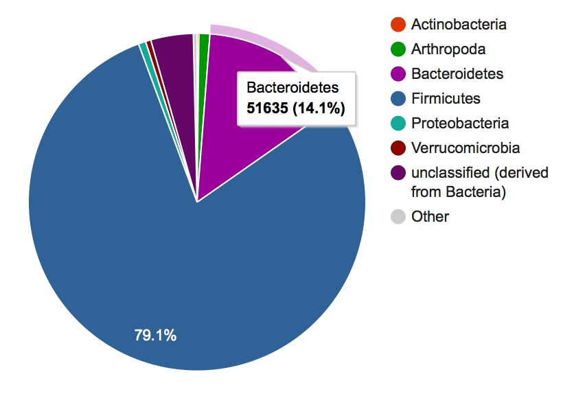
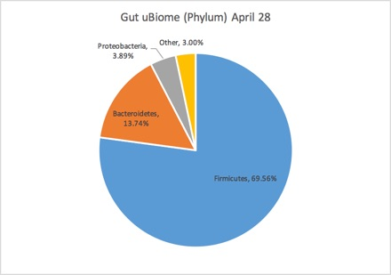
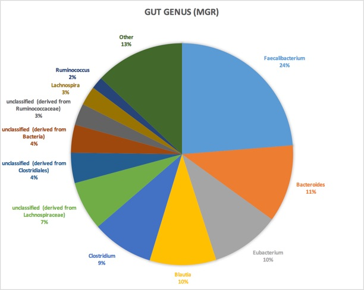
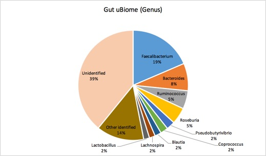

Here are the steps I took to make these charts

#Make a combined fastq file

The first few lines of my original fastq file `ssr_15759_R1_L001`:

	@NS500457:40:H3H3LAFXX:1:11101:3152:1054 1:N:0:TTGTAGCA+TGTAGCTG
	TGTGTGCCAGCCGCCGCGGTAATACGTATGGTGCAAGCGTTATCCGGATTTACTGGGTGTAAAGGGAGCGCAGGCGGAAGGCTAAGTCTGATGTGAAAGCCCGGGGCTCAACCCCGGTACTGCATTGGAAACTGGTCATCTAGAGTGTCGG

The third line is the read sequence, of length = 151. The entire fastq file is 215,000 lines long.

Similarly, the first few lines of the corresponding second run `ssr_15759_R1_L001.fastq`:

	@NS500457:40:H3H3LAFXX:1:11101:3152:1054 2:N:0:TTGTAGCA+TGTAGCT
	GGCCGGACTACCGGGGTTTCTAATCCTGTTTGCTCCCCACGCTTTCGAGCCTCAGCGTCAGTTATCGTCCAGTAAGCCGCCTTCGCCACTGGTGTTCCTCCTAATATCTACGCATTTCAACGCTACACTAGGAATTCCACTTACCCCTCCGA
As expected, the second run is the same read length and same number of lines as the first run.

This command uses a short Python script to combine the individual sequences for each run into a single file:

	% python ubiomeFastqCombine.py -c ssr_15759__R1__L001.fastq ssr_15759__R2__L001.fastq	
	
This script simply tapes together the sequences and associated error information  across the two runs and places the output in a new fastq file named `ssrL1.fastq`.

I ran this script for each of the four lanes and then combined the resulting four files into one huge one:

	% cat ssrL*.fastq > ssr15759Combo.fastq

The first few lines of the combined file:

	@NS500457:40:H3H3LAFXX:1:11101:3152:1054 1:N:0:TTGTAGCA
	+
	TGTAGCTGTGTGTGCCAGCCGCCGCGGTAATACGTATGGTGCAAGCGTTATCCGGATTTACTGGGTGTAAAGGGAGCGCAGGCGGAAGGCTAAGTCTGATGTGAAAGCCCGGGGCTCAACCCCGGTACTGCATTGGAAACTGGTCATCTAGAGTGTCGGGCCGGACTACCGGGGTTTCTAATCCTGTTTGCTCCCCACGCTTTCGAGCCTCAGCGTCAGTTATCGTCCAGTAAGCCGCCTTCGCCACTGGTGTTCCTCCTAATATCTACGCATTTCAACGCTACACTAGGAATTCCACTTACCCCTCCGA

As you can see, the first line shows, correctly, the stitched runs of the first lane.  Eyeballing the rest of the very long combined file (over 850,000 lines), the python script seems to have worked as intended.

Next I compress the file (to save on bandwidth) and submit to MG Rast:

	% gzip ssr15759Combo.fastq
	% curl -H "auth: myauthkeyhere" -X POST -F "upload=@ssr15759Combo.fastq.gz" "http://api.metagenomics.anl.gov/1/inbox/" > curl_output.txt
	
	
After the file has successfully uploaded, I submit the job using the default parameters and wait.

# Download into Excel

When the job is complete, MG RAST sends me to a page with my results, including this chart:

Click on the download button to get a TSV file that I can just copy/paste into Excel.  

With uBiome, I get the following Phylum-level chart:

As you can see, both are pretty similar, at least at the major taxa levels:

The Genus level looks like this (MGRast):

and uBiome is here:

Although there are some mismatches, they seem to agree at the highest levels.

[Here is the Excel file](
https://github.com/richardsprague/uBiome/blob/master/Data/sprague%20data/fastq-spragueuBiomeAprB2015/sprague-ubiome-150428%20vs%20MGRAST.xlsx) where I did all the calculations.

	

