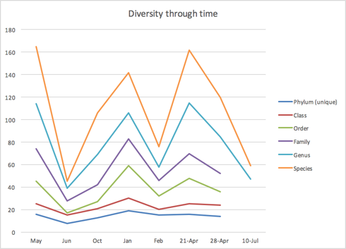

While there are few agreed-upon standards for what constitutes a good or bad microbiome, nearly everyone agrees that a diverse microbiome is better than one that is less diverse. How can we measure diversity?

Ecologists have been interested in this question for a long time and they’ve developed several metrics to describe how diverse a particular ecosystem is compared to another. This is my very tentative first step to try to adopt those metrics to my Ubiome results.

You could simply count all the different species (or genera or phyla) in a sample and track that over time. The more unique species, the more diversity. Here’s what this chart looks like for me:


```{r, echo=FALSE}
.myuBiomePath = "OneDrive/Projects/"
# set the root path for either Mac or Windows
if(Sys.info()["sysname"]=="Darwin") kRootPath=paste0("~/",.myuBiomePath) else kRootPath=paste0(paste0("c:/Users/",Sys.info()["login"]),"/",.myuBiomePath)

setwd(paste0(kRootPath,"uBiome"))
setwd("Data/sprague data")
```

```{r}

allSprague <- read.csv("spragueResultsThruJun2015.csv")


allGenus <- allSprague[allSprague$tax_rank=="genus",]
allPhylum<-allSprague[allSprague$tax_rank=="phylum",]
allSpecies<-allSprague[allSprague$tax_rank=="species",]
allSamples <- allGenus[,-(1:2)] 
require("vegan",quietly=TRUE)
dV <- sapply(allSamples,fisher.alpha)
names(dV)<-c(as.Date("2014-5-23"),as.Date("2014-6-10"),as.Date("2014-10-23"),as.Date("2015-1-15"),as.Date("2015-2-20"),as.Date("2015-4-20"),as.Date("2015-4-27"),as.Date("2015-6-15"))
g<-names(allSprague)
dPDates<-as.Date(names(dV))

```

Since 16S technology doesn’t capture all the species information, or the genera or phyla information for that matter, a simple count of the number of organisms detected is not terribly useful. In my case, uBiome identified between 90-97% of all the phyla in my samples, but only between 49-51% of the species. That makes apples-to-apples comparisons difficult to interpret.

Ecologists have suffered from this problem for a long time, and they came up with a few metrics to get around the problem. They start by considering what it means to say something is more diverse than another. Consider a forest that has 1,000 trees in it.  If all the trees are, say, aspen trees, then that forest is not as diverse as another one that also has 1,000 trees and 1,000 unique species.

Ecologists call this the Shannon number, after the information theorist Claude Shannon, who was the first mathematician to systematically try to measure information.  To Shannon, whose work was concerned with code breaking in World War II, a radio signal that carries information (i.e. a code) is noticeably different from one that is random noise.  He applied a specific formula to tell how different a signal looks compared to random noise, a variation of which can be applied to an ecosystem to tell how different it is from one that is completely dead (0) or has nothing but the same or similar organisms.

There is a slightly more ecologically interesting version of the Shannon number, called the Inverse Simpson number, that looks at the total number of unique life forms in an ecosystem and then weights each by the number of individuals of that type of species. Here is my diversity as measured with the Inverse Shannon number:

```{r}
#genus diversity
dG <- sapply(allGenus[,-(1:2)],diversity,index="invsimpson")  
plot(dG~dPDates,main="Genus Diversity",xlab="",ylab="Inv Simpson Diversity",xaxt="n")
axis(1,at=dPDates,labels=g[-(1:2)],las=2)
abline(lm(dG~dPDates),col="red")
```
That red line is the trend line calculated from the 