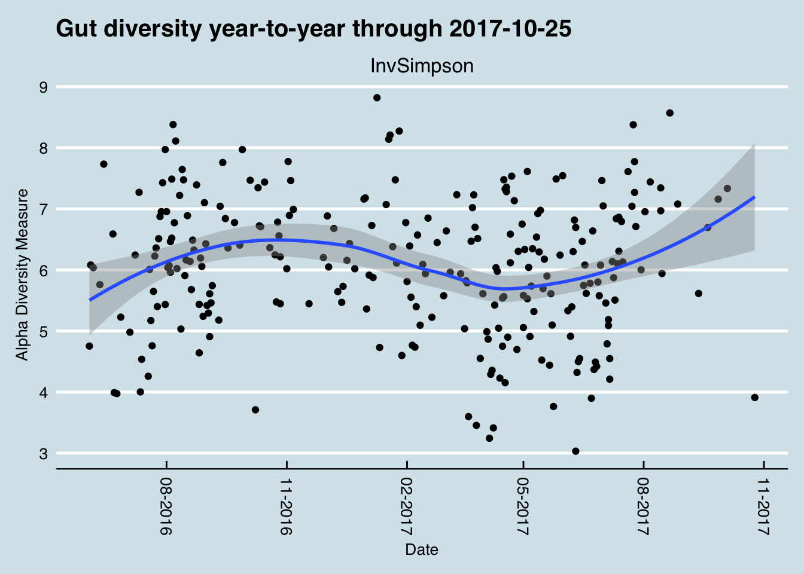

# About #
These repo contains source code and documentation that I've found useful in managing my uBiome results.

This is *not* the official uBiome repo, nor is anything here endorsed by uBiome. See the [official uBiome repo](https://github.com/ubiome-opensource/microbiome-tools) for that.

---

Intro
----

During the period from 2014 until late 2017, I sequenced over 500 samples of my microbiome. Inspired by the experiment in [David et al. (2014)](https://genomebiology.biomedcentral.com/articles/10.1186/gb-2014-15-7-r89), during most of that time I also carefully tracked the food I ate, my sleep, and other variables like activity or location. 

Most of my near-daily samples were of my gut, but I also regularly tested my skin, nose, and mouth. Since I’m generally healthy, I didn’t have a specific goal in mind other than to try to understand better what these microbes are doing, so many of my tests were taken while undergoing simple experiments, like eating a specific type of food or visiting a new location.

While not necessarily up to the rigorous standards of a formal scientific trial, these “n of 1” studies on myself helped me discover several new interesting facts about my own microbiome, many of which appear to contradict other published studies. In addition, hundreds of people sent me their own test results, letting me compare many different microbiomes. And of course, I also followed the latest developments in scientific publications and the general press as I eagerly tried to learn more.

Watch this site for details of what I did, and the source code showing how.

Other repos
---

* [Actino](https://github.com/richardsprague/actino) an R package that lets you read uBiome JSON and CSV files into the excellent open source [Phyloseq package](http://bioconductor.org/packages/release/bioc/html/phyloseq.html) from Bioconductor

* [Kombucha](https://github.com/richardsprague/kombucha) code and data to study a weeklong experiment where I drank lots of kombucha to see what happened to my gut microbiome.

* [Microbiome Hackers Guide](https://github.com/richardsprague/microbiome-hackers-guide) an early draft of a book describing all my experiments.

Next
----

Meanwhile, please see all my [microbiome-related posts](http://richardsprague.com/microbiome/)

