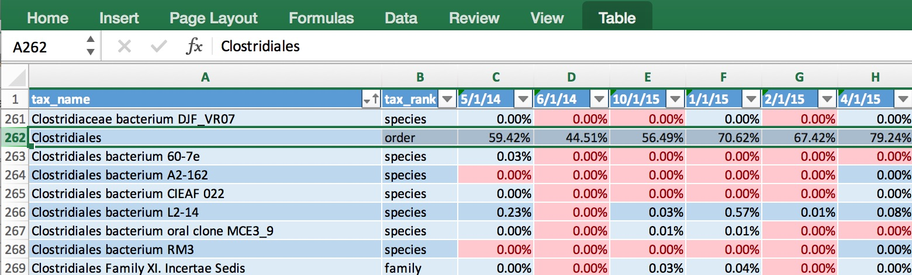
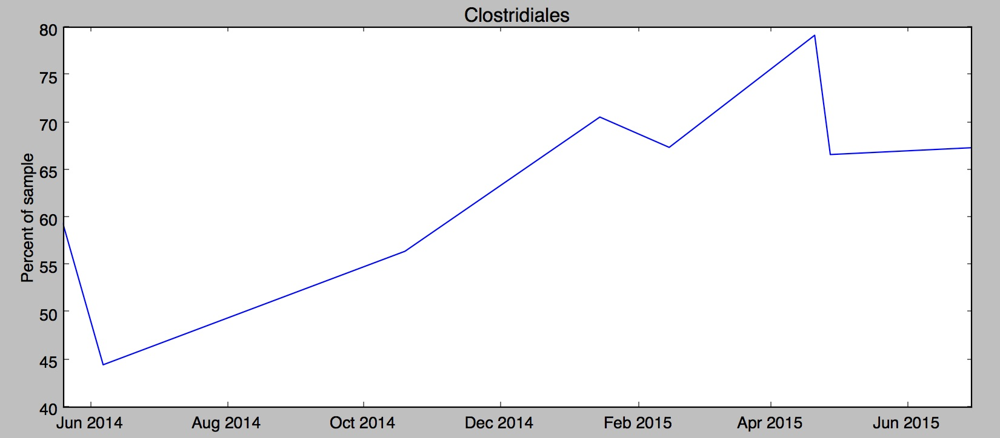

#All my uBiome results in a single table
I often read news about a fresh scientific discovery involving the microbiome and immediately wonder if the discovery applies to me. For example, I recently saw [a study from Oregon State University](http://www.sciencedaily.com/releases/2015/06/150622182034.htm) that seemed to find a link between high sugar diets and “cognitive flexibility”, i.e. your ability to adapt and adjust to changing circumstances. The study’s author, Kathy Magnusson, a professor in the OSU College of Veterinary Medicine, found that mice who eat lots of sugar have elevated levels of Clostridiales bacteria, and that this seemed to relate to a slower ability to solve a maze.  Hmmm, I thought — how much Clostridiales do I have?

If you have just one uBiome result, that’s easy: log into [http://app.ubiome.com](http://app.ubiome.com) and search for it in the section “All My Bacteria”. (As far as I know there’s no “search” button yet on the uBiome dashboard). But in my experience a single result doesn’t tell you much. You really need at least two and hopefully several uBiome results to see what might be actionable. In my case, I want to know how my Clostridiales may have changed over time.

I programmed a short Python script to generate a single Excel table with every bacteria I’ve ever found, and then a series of columns with the amount found in each sample. Something like [this](https://github.com/ubiome-opensource/microbiome-data/blob/master/sprague/spragueResultsthruJun2015.xlsx):

The data makes it easy to generate a chart showing how my Clostridiales changes over time:

Hmmm, in my case it looks like something happened since last fall to increase my Clostridiales levels. Maybe it was the potato starch I tried in order to [hack my sleep](http://www.ubiomeblog.com/hacking-sleep/)?  Was it my [trip to Central America](http://www.ubiomeblog.com/my-microbiome-in-the-jungle/) in February?  And of course the biggest question: has the increase affected my cognitive flexibility? I’m [not really sure](http://blog.richardsprague.com/2015/07/my-qs15-slides.html).  Whatever happened, the level of Clostridiales  seems to have stabilized in the past couple of months.

uBiome has identified more than 900 unique taxa (groups of organisms) in the half-dozen samples I've submitted over the past year, and after running this script I have them all laid out on a single page.  Now, armed with this one spreadsheet I can search anytime for a new microbe and quickly see if I have it now, or if it's ever been detected in a previous test. Reading news about microbiome has taken on a whole new personal meaning when I can see if the discovery relates to me.

If you know a little Python, you can make the same spreadsheet with your samples using the ubiome.py Python module on the [ubiome-opensource GitHub repository](https://github.com/ubiome-opensource); the script that generated my spreadsheet is [there](https://github.com/ubiome-opensource/microbiome-tools/blob/master/ubiomeSample.py) too as an example. And while you’re at it, please upload your own uBiome sample results to the same repository so we can compare.

