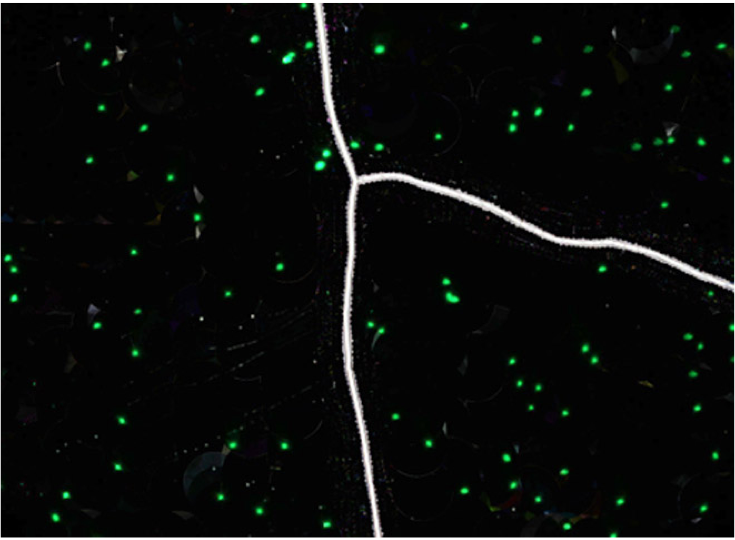
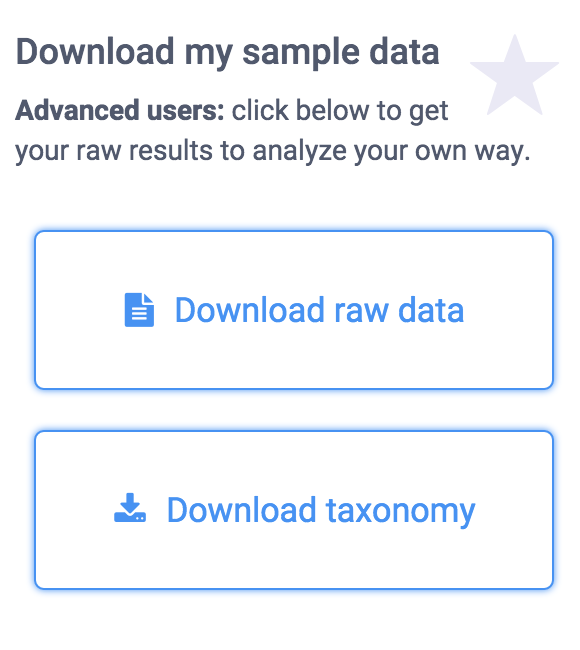
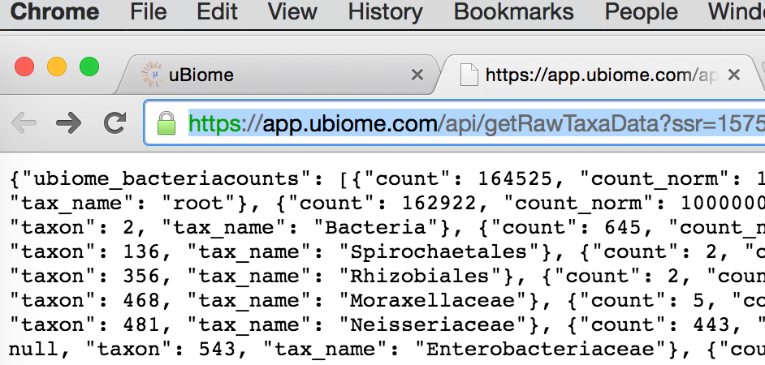
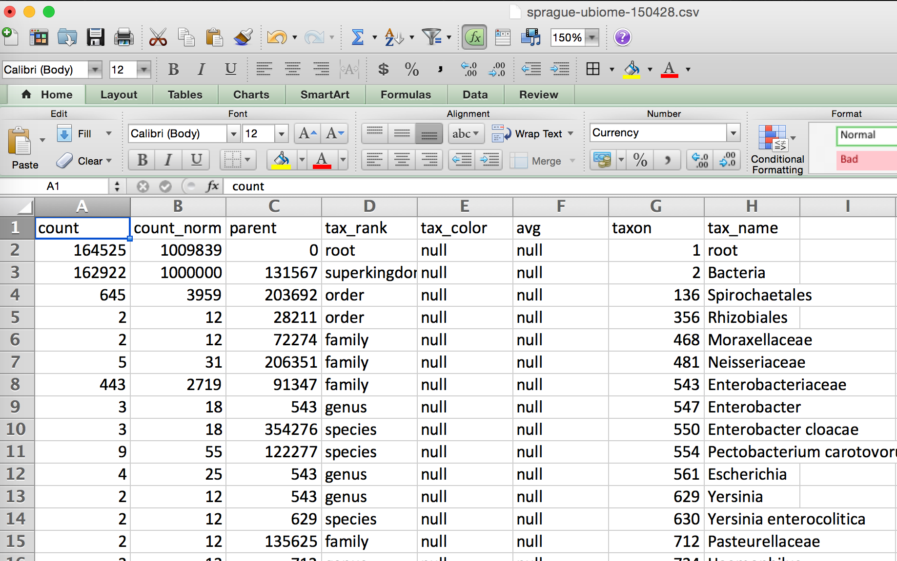

Base Header Level: 1
Title: 
Author:
Format: complete

Richard Sprague
PO Box 1523
Mercer Island
WA
98040
Sprague@ensembio.com


1,800 words


Hackers Guide to the Microbiome

by Richard Sprague

----

# Contents #

Manuscript	?
Title Page	?
Contents	?
Foreword	?
Chapter One - The Science	?
Microbes everywhere!	?
In the air	?
Underground	?
A crash course in microbiology	?
A crash course in botany	?
Chapter Two - The Technology	?
The old way: culturing	?
16s rRNA	?
Gene sequencing	?
Bioinformatics	?
Chapter Three - How to Analyze Your Microbiome	?
How to get your data	?
The basics: web tools	?
Endnotes	?
Chapter Five - Next Steps	?
Fermented food	?
Which Chapter Four - Organisms to Watch	?
Good and Bad	?

----

# Foreword #

The world of the small is very small indeed.


----

# Chapter One: The Science #

## Microbes everywhere! ##

Every human body is home to a rich environment of tiny living organisms, trillions of them, with their own genes, their own ways of living and surviving, and their own long histories, permanently intertwined with humanity since the beginning.

These microbes inhabit every possible niche inside and outside the body. Covering every inch of skin, lining every part of the nose and ears, they have burrowed deep inside nearly every organ, consuming as well as producing, living in such quantities that together they would weigh somewhere between three and five pounds --- about as much as the brain.

The word "microbe" refers to any tiny organism that carries its own genetic information for purposes of propagating itself. Much smaller even than the cells that make up our body, the vast majority of microbes are bacteria, though viruses and phages fit this description too, as well as archaea, the extremophile life forms that live and thrive in environments too challenging for bacteria. A typical human will have somewhere between [n and m] individual cells --- blood, skin, neurons, other tissues --- each descended from a single germ cell, the fertilized egg that began dividing itself and multiplying after the moment of conception. By contrast, microbes had to hitch their own rides later, beginning in the womb and turning into a flood at the moment of birth and beyond. But each microbe, like each human cell, remains deeply interconnected with the fates of all the other cells, all the way to the moment of death, and even after that.


### In the air ###

A team in France, performing experiments on snowflakes, discovered microbes in the sky.


1


### Underground ###

Three kilometers underground, in a South African gold mine, scientists discovered [microbe that lives on dirt]

There are even microbes that thrive in radioactive environments, like the dangerous interior of the Chernobyl nuclear reactor.


## A crash course in microbiology ##

Start with the cell. All living things are composed of cells.


## A crash course in botany ##

How do you talk about the relationships between various different life forms?


----

# Chapter Two: The Technology #

## The old way: culturing ##

How do you tell which microbe is which?

Until recently, the old fashioned way was the only way. You get some of the bacterium of interest and then grow more of it. In other words, a glorified version of farming.

How do you farm a microbe? Basically, you put it in a petri dish along with something that it likes to eat, and you wait for it to grow. What does it like to eat? Well, that's the "art". If you find the right substance and just the right environment, it might grow. Then again, it might not. Much of this is trial and error.
A bigger problem with culturing is that some organisms need other organisms in order to survive. You may be simply unable to grow the one of interest unless you have a whole colony of other, unrelated but symbiont organisms nearby to provide it something it needs. In other words, it may simply be impossible to grow a bunch of one particular organism in isolation.

## 16s rRNA ##

The 16S shortcut


## Gene sequencing ##

Gene sequencing


## Bioinformatics ##

Once you have the data computerized, the analysis tools leave the wet world of biology and enter the clean world of computing. This marriage is called bioinformatics.


----

# Chapter Three: How to Analyze Your Microbiome #

## How to get your data ##

There are several ways for an individual to get access to the powerful sequencers that make 16S rRNA analysis possible. 
I recommend the San Francisco company uBiome.

The most popular gene sequencer is the NextSeq500, from San Diego-based Illumina.


## The basics: web tools ##

After uBiome has notified you of your results, you can go to their web site to learn more.


## Analyze with Excel ##

The Illumina machines spit off huge amounts of data (FASTQ files can be hundreds of thousands of lines long), so to be useful you'll need a summary. UBiome provides a much more concise version called a "raw taxonomy" file, which is generally only a few hundred lines showing just the organisms they think they found in the sample.

What is JSON
UBiome's taxonomy files come in a simple structured text format called JSON (JavaScript Object Notation), commonly used across the web. Although it's not as convenient for people as the rest of the uBiome web site, programmers refer to JSON as "human readable", because if you squint enough you can sorta tell what it means without a computer program. Here's a sample:

	{
	  "ubiome_bacteriacounts": [{
	    "taxon": "2",
	    "parent": "131567",
	    "count": "22691",
	    "count_norm": "1000000",
	    "avg": null,
	    "tax_name": "Bacteria",
	    "tax_rank": "superkingdom",
	    "tax_color": null
	  }, {
	    "taxon": "1239",
	    "parent": "2",
	    "count": "15414",
	    "count_norm": "679300",
	    "avg": null,
	    "tax_name": "Firmicutes",
	    "tax_rank": "phylum",
	    "tax_color": "5E6591"
	  }

JSON is just structured data. That's it.  The data is organized according to keys and values. The keys are unique identifiers and the values are their values. The whole file looks that way. The only requirement of a JSON file is that it be consistent with this pattern, because after all it will need to be read by a computer eventually.
The uBiome Taxonomy JSON files identify the key ```uBiome_bacteriacounts``` which is mapped to a bunch of fields, each representing a particular organism found in your sample. Look at the figure above to get the basic idea.

Because uBiome JSON files are well-structured, it's easy to process them with other software, including Excel. That's our next step: bring this data into Excel.

Converting uBiome taxonomy JSON to Excel

If you just have one or two files, it's easy to bring uBiome taxonomy data into Excel. Go to the uBiome apps page and click on the section labeled "Download taxonomy".





You'll see a page of JSON representing what uBiome found in your sample.



On a desktop computer, if you select-all (press control-A or command-A) then you can copy this data to the clipboard to prepare to paste it to another web site.

There are many web sites that will convert JSON to a format that will work in Excel. Google "Json to Excel" or "Json to CSV" and you'll find one. Just paste your data into one of those sites to convert it for either Excel's native (XLS or XLSX) format, or the more universal CSV format, readable by Excel. Here are a few of the sites I've tested:
http://www.convertcsv.com/json-to-csv.htm
http://www.json-xls.com/json2xls

Once the data is in Excel, you can work with it just as you would with any Excel data sheet. Here's how one of my recent uBiome taxonomy files looks in Mac Excel:



Yours may look slightly different. Sometimes uBiome changes the labels on the taxonomy slightly, and the ordering of the columns may be different depending on how the JSON was converted, but none of that matters. The key is that you are now able to work with it in a full-blown spreadsheet.

The uBiome data tags
Let's review the meaning of each of the columns. The uBiome JSON taxonomy data includes the following fields:

The uBiome JSON taxonomy data includes the following fields:

count: an absolute measure of number of organisms found in the sample. Without knowing the size of the sample, or how many times the DNA inside was processed through PCR amplification, this number doesn't mean much except in relation to other counts at the same taxonomical rank.

count_norm: a "normalized" version of the count, created by simply dividing the count on a given row by the count found on the row with tax_name = Bacteria and then multiplying by one million. It's easier to just think of it as parts per million: each unit is 1 / 10,000th of a percent. For example, if you see a row with count_norm = 500,000, you can just think of that as 50% of the sample.

tax_name: this is the classification of the organism based on the level of its taxonomy. If you were looking at a human being, for example, you would see homo sapiens if you selected tax_rank = species, but you'd see mammalia if you selected tax_rank = class.

tax_rank: tells the level of the taxonomy. In daily conversation about animals or plants, we usually refer to the species (e.g. homo sapiens), but sometimes it's more useful to talk about bigger groupings of related organisms. For example, humans are members of the class mammalia, along with tigers and horses. If this spreadsheet were counting organisms at the level of class mammalia, the count_norm would almost certainly be bigger than the count_norm for humans alone, unless humans were the only type of mammal found in the sample.  

taxon and parent: these help identify the ranking in a more precise way by pointing out which tax_ranks are subsets of which. For example, Bacteroidia above has a parent = 976, meaning that it is a subset of the taxon 976, Bacteroidetes. When you follow the various taxons and parents up the chain, you'll see they all end in the superkingdom Bacteria, which has a taxon of 2. The values for these numbers, incidentally, are taxonomical numbers from the curated database at NCBI, the national bioinformatics center run by the U.S. government. Enter the number into the taxonomy browser at the NCBI Taxonomy Browser and you can learn as much as you want about that organism.

tax_color doesn't matter for this anaysis, but uBiome software uses this to colorize their pretty graphs to make them more readable.

----

# Endnotes #

----

# Chapter Four: Organisms to Watch #

## Good and Bad ##

As tempting as it is to categorize bacteria into groups like "good" and "bad", you should avoid that mistake. Very few organisms are always and everywhere either beneficial or harmful. Everything depends on the circumstances.
For example, from [Blaser p119]

"viridans" streptococci  "live peacefully in everyone's mouth...a leading cause of heart valve infections...normal residents of the mouth, only occasionally entering the bloodstream and landing on a previously damaged valve....if we mix harmless Viridans with pathogenic Group A strep, viridans always win out. They knock back the strep."


----

# Chapter Five: Next Steps #

## Fermented food ##

Once you've developed an appreciation for the importance of the microbiome, you'll want to become more of a farmer, growing your own symbionts.

People have been fermenting food since the distant past, making everything from beer to cheese. Fermentation is an ideal way to preserve food beyond the date at which it is practical to eat.

 

## Annnoted References ##

Here are my suggestions for additional reading.

