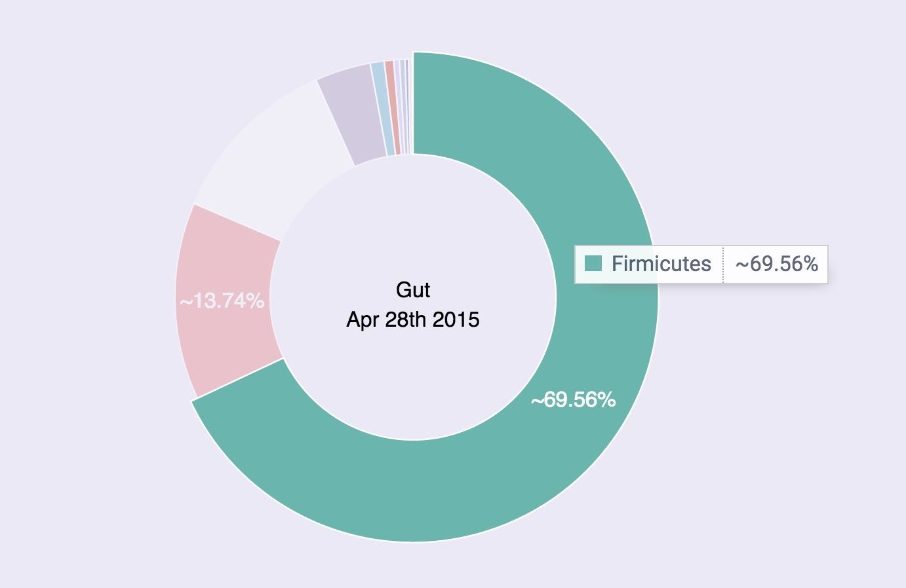
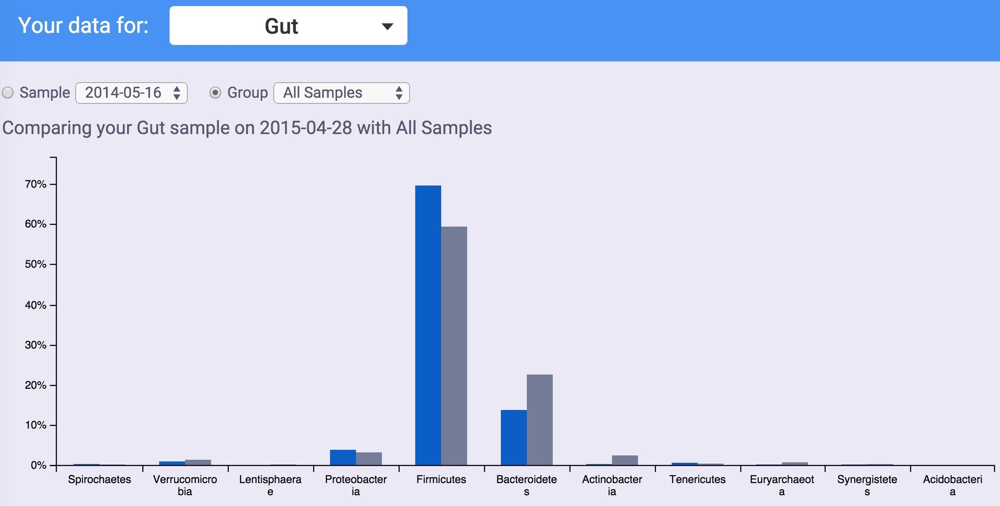

Base Header Level: 1
Title: 
Author:
Format: complete

Richard Sprague
PO Box 1523
Mercer Island
WA
98040
Sprague@ensembio.com


8,600 words


Hackers Guide to the Microbiome

by Richard Sprague

----

# Contents #

Contents	?
Foreword	?
Chapter One - The Science	?
Intro	?
Microbes everywhere!	?
In the air	?
Underground	?
A crash course in microbiology	?
A crash course in botany	?
What are they doing?	?
Studying the Human Microbiome	?
Chapter Two - The Technology	?
Studying the Microbiome	?
The old way: culturing	?
16s rRNA	?
Gene sequencing	?
Bioinformatics	?
Chapter Three - How to Analyze Your Microbiome	?
How to get your data	?
The basics: web tools	?
Analyze with Excel	?
Comparing samples	?
Chapter Four - Organisms to Watch	?
Good and Bad	?
Chapter Five - Next Steps	?
Fermented food	?
Annnotated References	?
Endnotes	?

----

# Foreword #

This book is for curious people with little or no knowledge of biology, but who have a reasonable level of comfort with computer software, either as programmer, or as an end-user comfortable with the basics of installing and running common applications (Excel).

The book is divided into four main sections:

1. The Science: an introduction to the field of the microbiome. What makes it so interesting? How do scientists go about studying it? How much is known today and what is likely to be discovered in the future?

2. Technology. What are the instruments and tools available to study the human microbiome? 

3. How to analyze your own microbiome: we'll walk step-by-step through the process of getting and then analyzing data about your own microbiome. Starting with easy-to-understand web tools, we'll walk you through the basics, then show you how to do simple analysis in Excel. For more complicated analysis, we'll introduce simple (free) programming tools and show step-by-step how to use them to study your own microbiome as well as compare it to others.

4. Organisms to watch: Once you've begun the process of studying your own microbes, you'll want to know about some of the common ones and what they do. We'll walk through the basics and show you how to design experiments that let you watch the progress over time.

5. Next steps. The information in this book will introduce you to the basics, but once you see how fascinating the microbiome can be, no doubt you'll want to go further. We'll show you how to begin growing your own favorite microbes, and then give you a taste of some of the tools that professional biologists use to analyze in much more detail.


----

# Chapter One: The Science #

## Intro ##

I'm a software guy, and when I think about what it means to be human, I think first of course of all the various "software" we are made of: our language, culture, education, behaviors --- all things that seem to us to be flexible, even arbitrary, but which define us as individuals. But as with computers, the software can only run as well as the hardware, so I'm interested in that too: what is the CPU, the memory, the graphics card? and how can you expand or make it better and faster? What should you do to maintain your hardware?

To learn more about your hardware, you can of course measure various things about yourself: temperature, blood tests, activity levels. New products like the Apple Watch are making this much easier, and in the near future you'll see an explosion of new and better ways to measure your body's hardware and with better, more actionable measurement come many ways to modify and optimize your health along the way. All of these new wearable computing devices recognize that you  are a unique individual and that we always should treat the patient, not the statistics. So what is the part of you that is fundamentally you?

The obvious place to start is with DNA, and our human genes. I was excited when 23andme (and other services) came out about ten years ago, letting each of us inexpensively see our internal hardware, perhaps to learn more about the things that make us unique, and maybe peer into our futures, to the degree that biological traits like susceptibility to various diseases or conditions is hereditary and unchangeable.

But after a while I realized how little of what we learn about DNA is actionable. If you find you have the "gene for"  Alzheimer's disease or Parkinson's, or any of the other traits that have been linked to specific genes, what can you do about it? In nearly every case, the advice is exactly what you should be doing even if you don't have that trait: eat well and get lots of exercise.


Fortunately, it's not just our DNA
In fact, if you could point a scanner at me and pull out everything, all the "hardware" inside me right now, you'd find a curious fact: although sure, 99% of the weight and size of what you see is human (blood, skin, bones, organs, etc.), only about 10% of the cells are human, and even less than that  --- only about 1%  --- of the DNA-storing genes are human.

What's the rest? Who am I, if only 1% of the genes inside me are human? The answer is microbes, and as befits something that so outnumbers the "human" part of us, they play a large role in everything about what we do, from our health to our moods and even, as I'll show, to our motivations.

Microbes are older than any of us
We tend to think of the invisible, single-celled microbes as "primitive", not nearly as "advanced" as we humans, with our marvelous brains and ability to transform the earth with airplanes and skyscrapers and nuclear reactors and all the rest. But that's what we would think, wouldn't we? In fact, the microbes are everywhere, literally everywhere on earth, in the sky, even deep underground. We can't go anywhere without encountering microbes because, well, there are even microbes on and inside us. Humans can't survive without microbes. So what does it even mean to say we're "better" or more "advanced" than they are?

Before the microscope, people didn't even know that microbes existed. Similarly, until the advent of large-scale gene sequencing machines in the past ten years, almost nothing was known about the amazing ubiquity and resilience of microbes.

Yes, they're single-celled and yes many of their cellular functions seem more straightforward than the functions of a multi-cellular creature like us, but it would be a mistake to assume that means microbes -- collectively -- are less influential, and certainly it would be a big error to assume they are less important. Fact is, these organisms have been around, breathing, eating, multiplying, for billions of years, often in pretty much the same form that they are today. These things have survived every imaginable planetary condition from volcanoes to the depths of the ocean to the inside of nuclear reactors. Global Warming means nothing to these guys, who have seen and thrived all over the earth since the day life first appeared.

What they want
Because they have such a huge advantage over us, in lifespan (each microbe is an exact divided copy of itself, going back a zillion generations), in speed of replication (they can double in just a few minutes under the right conditions),  and ubiquity (as I said, cellwise they far outnumber us), they can afford to colonize every new imaginable environment. 

And that's what they do, every time a new frontier opens to them. The moment of your birth, for example, when you left the (mostly) sterile conditions of your mother's womb, they immediately flooded all over your skin, mostly coming from your mother, and in that fresh environment they used their first-mover advantage to get a stronghold that in many cases lasts your entire life. Many (most?) of the microbes that matter arrived inside you this way, originally, and many of them are still there today, decades, even half a century or more later. 

To survive, they need one thing: something to eat. Being so tiny, they don't need much, and they mostly eat things that you (and other larger creatures) weren't interested in anyway. (Or, since they were here first, it's probably more accurate to say that you and I must live on the foods that they don't want. A cheeseburger is only food for you because you snatch it faster than they do. Leave it outside for a while and they'll get it eventually).

Who's in charge?
Collectively, the multitude species of microbes will eat just about everything, but individually each species has its preferences. When they're outside the body, as I said, they can "colonize" new territories (like fresh baby skin) to get what they want, but those inside your tummy are at the mercy of whatever it is you decide to put into your mouth.

Often, that's not a big deal: many species thrive on the same proteins, carbohydrates, and fats that you do. But some species do better than others with certain types of foods, and this is where the line between your human desires and theirs becomes unclear.

Eighty percent of all your brain's outside receptors -- counting all the nerve endings everywhere on your skin -- eighty percent complete their connections in the gut. The main switching grounds, an area called the vagus nerve, does something.  What? We know very little, but we see some evidence that the purpose -- the reason that not 1% or 10% or 50% but a full 80% of all the receptors go to the gut -- is so the microbes can tell your brain what to do.

When you find yourself feeling hungry, ask yourself who is feeling hungry. Scientists have traced that feeling of hunger to changes in certain hormones like leptin, but wait -- why did the leptin levels change in the first place? Could it be that a microbes someplace was manipulating your leptin levels, perhaps by poking that vagus nerve just the right way -- to get your brain to start thinking about whatever food that microbe wants?

This isn't as ridiculous as it sounds, the idea that microbes could influence your feelings and desires. Think about a disease like the rabies microbe. Because it spreads through saliva, it can't find new territory unless its host somehow finds itself exchanging saliva -- biting -- another potential host. So guess what a rabies victim can't stop thinking about? Biting a new victim.  The microbe literally puts a thought into the mind.

There are many other examples, so many in fact as to be potentially a bit disturbing when we realize that we humans may be much more at the mercy of tiny microbes than we think.  Links have been made between microbes and schizophrenia, stress, anxiety, self-grooming, and much more.  Autism Spectral Disorders, which have always seemed puzzling because of the relationship they seem to have with digestive problems, are also linked to microbes,  or the lack thereof.

Perhaps the most intriguing example is the common parasite Toxoplasma gondii, the strange organism that can only reproduce in the intestines of cats. A parasite seen often in all warm-blooded mammals, it's found in about a third of the global population of humans too.  It's one of the reasons they tell pregnant women to stay away from cat litter. But here's the interesting part: when a Toxo protozoa infects a mouse, it leaves cysts in the mouse brain that make it attracted to cat urine! Yes, it changes the neurology of a mouse so that it's more likely to end up inside a cat's tummy -- exactly where it can reproduce.

Think about this too much, and you'll end up with the obvious question: what other weird microbes are infecting us right now? Can we explain some of our own behaviors this way? Is there a human equivalent of these infections, driving us to do things we "ordinarily" wouldn't do? And maybe these microbes are so ubiquitous, teeming all over us and in our brains, maybe there's no way to even know what "ordinary" or "normal" human behavior is.


What is health?
There's a new idea in science (well, maybe it's not new, but it's new to me and that's why I'm talking about this). Maybe you can't really think about human hardware without thinking about the whole ecology that goes with it, the various organisms live in and around us and greatly outnumber us.

When you think this way, then suddenly "health" takes on a whole new meaning, because we're no longer talking about the status of a single organism -- me -- but rather about the entire function "eco-system" of many, many living things, including  the "me" that I want to refer to as a human.


## Microbes everywhere! ##

Every human body is home to a rich environment of tiny living organisms, trillions of them, with their own genes, their own ways of living and surviving, and their own long histories, permanently intertwined with humanity since the beginning. These microbes inhabit every possible niche inside and outside the body. Covering every inch of skin, lining every part of the nose and ears, they have burrowed deep inside nearly every organ, consuming as well as producing, living in such quantities that together they would weigh somewhere between three and five pounds --- about as much as the brain.


The word "microbe" refers to any tiny organism that carries its own genetic information for purposes of propagating itself. Far too small to see with the naked eye, dozens could fit inside a typical human cell. The vast majority of microbes are bacteria, though viruses and phages fit this description too, as well as archaea, the extremophile life forms that live and thrive in environments too challenging for bacteria. A typical human will have somewhere between [n and m] individual cells --- blood, skin, neurons, other tissues --- each descended from a single germ cell, the fertilized egg that began dividing itself and multiplying after the moment of conception. By contrast, microbes had to hitch their own rides later, beginning in the womb and turning into a flood at the moment of birth and beyond. But each microbe, like each human cell, remains deeply interconnected with the fates of all the other cells, all the way to the moment of death, and even after that.


### In the air ###

A team in France, performing experiments on snowflakes, discovered microbes in the sky.


1

These microbes are so numerous that they affect the climate. 


### Underground ###

Three kilometers underground, in a South African gold mine, scientists discovered [microbe that lives on dirt]

There are even microbes that thrive in radioactive environments, like the dangerous interior of the Chernobyl nuclear reactor.


Subglacial Lake Whillans is a lake found under more than 800 meters of ice in the West Antarctic. A careful underground bore hole was inserted by a team from Louisiana State University in 2014 [http://www.nature.com/nature/journal/v512/n7514/full/nature13667.html]  and found more than 4,000 different species of bacteria surviving under the ice. The total bacterial count was not that different from the count you'd find in surface lakes on other parts of the planet, a fact that is especially surprising for an environment that hasn't had a ray of light in millions of years. The bacteria instead thrive on iron, sulphur, and nitrogen as energy sources.
http://earthsky.org/earth/diverse-microbes-found-deep-beneath-antarctic-ice-sheet


## A crash course in microbiology ##

Before we learn how to study your own microbiome, let's review some of the science.

All life runs on three chemical building blocks:  DNA, RNA, and proteins. Each of these is an arbitrarily-long chain of repeating molecules called nucleotides (DNA or RNA) and amino acids (proteins). Due to constraints on the way atoms interact, the set of building blocks is fixed. All DNA is composed of only four nucleotides: adenine, thymine, guanine, and cytosine, represented by the letters ATGC. RNA is composed of the same molecules, except that uracile (U) is substituted for thymine.
Similarly, proteins are constructed with only 20 different amino acids, which can again be represented by a short three-character abbreviation.
The correspondence between these different proteins and combinations of DNA or RNA is referred to as the genetic code. 


nonpolar
polar
basic
acidic
(stop codon)
Standard genetic code
1st
base
2nd base
3rd
base
T
C
A
G
T
TTT
(Phe/F) Phenylalanine
TCT
(Ser/S) Serine
TAT
(Tyr/Y) Tyrosine
TGT
(Cys/C) Cysteine
T
TTC
TCC
TAC
TGC
C
TTA
(Leu/L) Leucine
TCA
TAA
Stop (Ochre)
TGA
Stop (Opal)
A
TTG
TCG
TAG
Stop (Amber)
TGG
(Trp/W) Tryptophan    
G
C
CTT
CCT
(Pro/P) Proline
CAT
(His/H) Histidine
CGT
(Arg/R) Arginine
T
CTC
CCC
CAC
CGC
C
CTA
CCA
CAA
(Gln/Q) Glutamine
CGA
A
CTG
CCG
CAG
CGG
G
A
ATT
(Ile/I) Isoleucine
ACT
(Thr/T) Threonine        
AAT
(Asn/N) Asparagine
AGT
(Ser/S) Serine
T
ATC
ACC
AAC
AGC
C
ATA
ACA
AAA
(Lys/K) Lysine
AGA
(Arg/R) Arginine
A
ATG[A]
(Met/M) Methionine
ACG
AAG
AGG
G
G
GTT
(Val/V) Valine
GCT
(Ala/A) Alanine
GAT
(Asp/D) Aspartic acid
GGT
(Gly/G) Glycine
T
GTC
GCC
GAC
GGC
C
GTA
GCA
GAA
(Glu/E) Glutamic acid
GGA
A
GTG
GCG
GAG
GGG
G
A The codon ATG both codes for methionine and serves as an initiation site: the first ATG in an mRNA's coding region is where translation into protein begins.[1]
Inverse table (compressed using IUPAC notation)
Amino acid
Codons
Compressed

Amino acid
Codons
Compressed
Ala/A
GCT, GCC, GCA, GCG
GCN
Leu/L
TTA, TTG, CTT, CTC, CTA, CTG
YTR, CTN
Arg/R
CGT, CGC, CGA, CGG, AGA, AGG
CGN, MGR
Lys/K
AAA, AAG
AAR
Asn/N
AAT, AAC
AAY
Met/M
ATG
Asp/D
GAT, GAC
GAY
Phe/F
TTT, TTC
TTY
Cys/C
TGT, TGC
TGY
Pro/P
CCT, CCC, CCA, CCG
CCN
Gln/Q
CAA, CAG
CAR
Ser/S
TCT, TCC, TCA, TCG, AGT, AGC
TCN, AGY
Glu/E
GAA, GAG
GAR
Thr/T
ACT, ACC, ACA, ACG
ACN
Gly/G
GGT, GGC, GGA, GGG
GGN
Trp/W
TGG
His/H
CAT, CAC
CAY
Tyr/Y
TAT, TAC
TAY
Ile/I
ATT, ATC, ATA
ATH
Val/V
GTT, GTC, GTA, GTG
GTN
START
ATG
STOP
TAA, TGA, TAG
TAR, TRA


As a programmer looking through all of this, you may immediately be inspired to write your own software version of this. After all, the remarkable consistency between all of these building blocks cries out for manipulation by computer.
In fact, that's exactly what bioinformaticians do, and numerous software packages have been developed to make it easy to treat these building blocks of life like ordinary computer strings. 

Perhaps the biggest challenge is the volume of data to be handled, which can easily be measured in gigabytes for a simple organism, but can require entire server farms in the case of some real-world biological systems. For that reason, much of bioinformatics is about optimizations to improve the speed of processing a large data set, or to simply the presentation in a way that can reveal the most biologically interesting aspects of a problem without wading in over-complexity.
 
One special protein, DNA, can store information

The cell


Start with the cell. All living things are composed of cells, which are tiny self-contained blocks where entropy is kept at bay for as long as possible. Everything in the universe tends over time to fall into disorganized entropy, but cells contain many tricks, honed over billions of years of evolution, to thrive.

Some organisms have a single cell, and others are multi-cell, but the key division of life is not between the number of cells but rather in the complexity of its internals. Human cells, like all multicellular life forms, are classified as eukaryotes, because all of our cells are made of a number of internal features, called organelles, of which the most prominent is the nucleus. 
Bacteria, by contrast, are prokaryotes. Their cells look much simpler under a microscope: just a cell wall bounding some free-floating objects. 


Part of the definition of life is the ability to reproduce, and cells do this by dividing themselves in half in a process called mitosis. 


## A crash course in botany ##

How do you talk about the relationships between various different life forms?

A taxon is a simple unit of life. A homo sapiens is a taxon, but so is a primate. A mammal is a taxon too. It might seem odd in the ordinary biological world to bother using the same term 'taxon' to refer to all of those units, but for bacteria and anything that reproduces asexually, it's an important distinction because often, taxonomists don't agree about whether a group of organisms is part of the same taxon or not.


Since Carl Linnaeus in the 1700's, the science of taxonomy divides all life into seven major categories: Kingdom, Phylum, Class, Order, Family, Genus, Species (which I was taught in sixth grade to remember by the mnemonic "King Philip Came Over for Girl Scouts"). 


Bacteria make up their own kingdom. Just as the animal kingdom includes everything from humans to jellyfish to beetles, the diversity of bacterial life is enormous, a point which can't be emphasized too much. This is true at every rank in the taxonomy. Even two organisms that are the same at a lower rank, like genus, might have radically different affects on the human body, just as a member of the animal genus Canis could be anything from a wolf or coyote to a Chihuahua. 

You cannot mix and match these ranks. If you know something about the number of organisms in one genus, for example, this is meaningful only in comparison to the numbers of another genus. Keep that in mind during our analysis. 


## What are they doing? ##

Toxoplasma Gondii is a tiny microbe that, for some reason, only likes to reproduce from within the gut of a cat. It can be found in almost all warm-blooded mammals, including humans --- about 30% of us, according to some estimates, and that's after a century of obsession with hygiene that has wiped out countless other tiny inhabitants of the body.
T. Gondii seem harmless because its hosts appear to show no differences before or after "infection" except in one creature: the mouse. When it finds itself ingested by a mouse, it appears to fade away quietly. MRI scans show large amounts in the gut for a week or two, gradually decreasing until there is apparently nothing. Except: tiny T. Gondii cysts begin to show up in the mouse's brain. Not everywhere, but in just a few strategic places.
Then something strange happens: the mouse is suddenly attracted to cat urine. And note: its only attraction is to cat urine, not rabbits, not humans --- only cats. Everything else about the mouse appears normal. It still seems to be afraid of the other things that scare mice: other predators, stressful situations. But put a T. Gondii-affected mouse into a maze with different animal urine in the corners and it will rush to the cat side every time.

How is it that T. Gondii is able to be so precise in its effects? It only seems to affect mice, and even then it only apparently makes them attracted to cats. It doesn't apparently cause any other harm to its hosts, so --- somehow --- it must have found a resting place right at the spot in the mouse brain that affects its interest in cats.

Although there doesn't seem to be any major negative consequences to humans hosting T. Gondii, some scientists aren't sure. One man in particular, Jaroslav Flegr, an evolutionary biologist at Charles University in Prague, thinks he has evidence that women who carry it might be more trusting than those who don't. 

T.Gondii isn't the only microbe known to affect the behavior of its host. A more common example is the rabies virus, which upon infection somehow causes a mammal to be more agitated, more likely to strike out --- or bite --- other humans, thereby spreading itself.

Or syphilus, the disease spread by the bacterium [syphilius] and causes its host to go insane. The microbe is somehow able to infect the mind of the victim.
In general, sexually transmitted diseases are especially likely to have behavioral consequences. A sexual disease that produces symptoms is unlikely to spread, yet it still requires contact with a new victim. Perhaps the ideal vector is a behavioral change, making the host more likely to come in contact with a new host.

Think about this too much, and you'll end up with the obvious question: what other weird microbes are infecting us right now? Can we explain some of our own behaviors this way? Is there a human equivalent of these infections, driving us to do things we "ordinarily" wouldn't do? And maybe these microbes are so ubiquitous, teeming all over us and in our brains, maybe there's no way to even know what "ordinary" or "normal" human behavior is.


## Studying the Human Microbiome ##

Studying the Human Microbiome

During the late 1990s, biologists around the world were racing to complete the first sequence of the human genome, a first draft of which was available in June 2000, and the project was declared complete in 2003. With this sequence available, scientists now had the first rough map of all the genes that make up a human being, and they were hopeful that this would be quickly followed by new discoveries linking genes to health. 

The Human Microbiome Project was launched in 2008 by the National Institutes of Health with a budget of $115M.


----

# Chapter Two: The Technology #

## Studying the Microbiome ##

Two major problems had to be solved before scientists could begin seriously studying the microbiome.
First, the various bacteria inside us had to be identified. Since the invention of the microscope, the process was straightforward: collect enough of the organisms of interest and then look at them, either as a whole while cultured in a lab, or individually under the microsoft.

Computer scientists have an easier time than biologists because operations are so fast you can afford to do them over and over. In biology, individual operations are much slower, but you can run them in parallel. That goop in the petri dish is often made of trillions of organisms, each one consuming, producing, and multiplying individually. Even with the very low error rates in ordinary cell division, you have so many organisms that you will regularly get a few mutations, and if the experiment is well-controlled, you will be able to see those mutations.


## The old way: culturing ##

How do you tell which microbe is which?

Until recently, the old fashioned way was the only way. You get some of the bacterium of interest and then grow more of it. In other words, a glorified version of farming.

How do you farm a microbe? Basically, you put it in a petri dish along with something that it likes to eat, and you wait for it to grow. What does it like to eat? Well, that's the "art". If you find the right substance and just the right environment, it might grow. Then again, it might not. Much of this is trial and error.
A bigger problem with culturing is that some organisms need other organisms in order to survive. You may be simply unable to grow the one of interest unless you have a whole colony of other, unrelated but symbiont organisms nearby to provide it something it needs. In other words, it may simply be impossible to grow a bunch of one particular organism in isolation.

## 16s rRNA ##

The 16S shortcut


## Gene sequencing ##

Gene sequencing


## Bioinformatics ##

Once you have the data computerized, the analysis tools leave the wet world of biology and enter the software world of computing. This marriage is called bioinformatics.


----

# Chapter Three: How to Analyze Your Microbiome #

## How to get your data ##

There are several ways for an individual to get access to the powerful sequencers that make 16S rRNA analysis possible. 

That said, just as I mentioned 23andme as a way to find information about your DNA, there are a few ways you can get information about your microbiome.  One way is through a doctor, or other health care provider who can give you a clinical test, just like you might do a blood draw as part of an annual physical. If you have a medical condition, the tests are likely covered by insurance, but tend to be pretty expensive (several hundred dollars or more). 

For "normal" people, just curious about the science like I am, there are two other ways to find out your microbiome:

 The first is called American Gut Project, associated with a lab at the University of California San Diego and others.  For a $100 donation, they'll send you a sampling kit which you send back to get a breakdown of your gut bacteria. American Gut boasts an impressive number of practicing research scientists, including several of the key contributors to the Human Microbiome 


I recommend the San Francisco company uBiome.

History of uBiome
The company was founded in late 2012 by Jessica Richman and Zach Apte, who met while doing graduate studies at Oxford. Jessica, with an undergraduate degree from Stanford, was studying public policy, using computers to understand how new ideas go viral. Zach was a biologist studying the microbiome, disappointed at how long it took to collect the vast number of samples required to do the science. The problem, they realized, was not lack of interest from the general public. There was no shortage of people interested in the microbiome and its affect on health, many of whom would happily contribute samples if they could help the science. They suspected that many of these "citizen scientists" were so eager to help that they might even pay for the privilege of participating in an experiment, particularly if they could receive personalized results of their own tests.
In November 2012, they launched their first crowd funding campaign on the site Indiegogo, hoping to raise $100,000 to start the business. They started by selling "perks", $89 for a gut kit, $399 for a five-sample kit, offering to run the samples through the sequencing machine that Zach Apte was using at the University of California San Francisco biotech startup garage. To their surprise, the campaign raised more than $350,000, and the company was off and running.
Since uBiome focused from the beginning on crowd-sourced open science, their kits were designed to be as easy to use as possible. With glossy-printed, step-by-step directions and an attractive kit with well-labeled test tubes, they wanted to let ordinary people take samples and submit them with as little fuss as possible.
At the lab, uBiome also focused on automation. They built two special collection robots that could open the test tubes with the ultimate goal that they'd be able to submit to the sequencing machine with barely any human intervention.


The strong start with the Indiegogo campaign brought them enough money to start the business, but more importantly it attracted the attention of other investors who soon contributed $1.5M to the new company. Eventually the uBiome staff signed on to the prestigious Y-Combinator, the startup incubator that has given birth to many famous names including Airbnb, Reddit, Dropbox and others, and landed an additional $3M investment from the prestigious venture capital firm Andreessen Horowitz.
With the new investment capital, uBiome was able to open a new headquarters and buy their own $300,000 NextSeq500 gene sequencing machine and more automation to help them process the samples more quickly.

The most popular gene sequencer is the NextSeq500, from San Diego-based Illumina.


## The basics: web tools ##

After uBiome has notified you of your results, you can go to their web site to learn more.

The first thing you'll notice is a pretty chart like this one:


This shows the overall breakdown of the bacteria they found in your gut. In this chart, the bacteria are lumped by phyla ---the highest, broadest level of classification. If you're like most Americans, the vast majority of your sample will be one of two phyla: bacteroidetes or firmicutes. 



## Analyze with Excel ##

The Illumina machines spit off huge amounts of data (FASTQ files can be hundreds of thousands of lines long), so to be useful you'll need a summary. UBiome provides a much more concise version called a "raw taxonomy" file, which is generally only a few hundred lines showing just the organisms they think they found in the sample.

What is JSON
UBiome's taxonomy files come in a simple structured text format called JSON (JavaScript Object Notation), commonly used across the web. Although it's not as convenient for people as the rest of the uBiome web site, programmers refer to JSON as "human readable", because if you squint enough you can sorta tell what it means without a computer program. Here's a sample:

	{
	  "ubiome_bacteriacounts": [{
	    "taxon": "2",
	    "parent": "131567",
	    "count": "22691",
	    "count_norm": "1000000",
	    "avg": null,
	    "tax_name": "Bacteria",
	    "tax_rank": "superkingdom",
	    "tax_color": null
	  }, {
	    "taxon": "1239",
	    "parent": "2",
	    "count": "15414",
	    "count_norm": "679300",
	    "avg": null,
	    "tax_name": "Firmicutes",
	    "tax_rank": "phylum",
	    "tax_color": "5E6591"
	  }

JSON is just structured data. That's it.  The data is organized according to keys and values. The keys are unique identifiers and the values are their values. The whole file looks that way. The only requirement of a JSON file is that it be consistent with this pattern, because after all it will need to be read by a computer eventually.
The uBiome Taxonomy JSON files identify the key ```uBiome_bacteriacounts``` which is mapped to a bunch of fields, each representing a particular organism found in your sample. Look at the figure above to get the basic idea.

Because uBiome JSON files are well-structured, it's easy to process them with other software, including Excel. That's our next step: bring this data into Excel.

Converting uBiome taxonomy JSON to Excel

If you just have one or two files, it's easy to bring uBiome taxonomy data into Excel. Go to the uBiome apps page and click on the section labeled "Download taxonomy".


You'll see a page of JSON representing what uBiome found in your sample.


On a desktop computer, if you select-all (press control-A or command-A) then you can copy this data to the clipboard to prepare to paste it to another web site.

There are many web sites that will convert JSON to a format that will work in Excel. Google "Json to Excel" or "Json to CSV" and you'll find one. Just paste your data into one of those sites to convert it for either Excel's native (XLS or XLSX) format, or the more universal CSV format, readable by Excel. Here are a few of the sites I've tested:
http://www.convertcsv.com/json-to-csv.htm
http://www.json-xls.com/json2xls

Once the data is in Excel, you can work with it just as you would with any Excel data sheet. Here's how one of my recent uBiome taxonomy files looks in Mac Excel:


Yours may look slightly different. Sometimes uBiome changes the labels on the taxonomy slightly, and the ordering of the columns may be different depending on how the JSON was converted, but none of that matters. The key is that you are now able to work with it in a full-blown spreadsheet.

The uBiome data tags
Let's review the meaning of each of the columns. The uBiome JSON taxonomy data includes the following fields:

The uBiome JSON taxonomy data includes the following fields:

count: an absolute measure of number of organisms found in the sample. Without knowing the size of the sample, or how many times the DNA inside was processed through PCR amplification, this number doesn't mean much except in relation to other counts at the same taxonomical rank.

count_norm: a "normalized" version of the count, created by simply dividing the count on a given row by the count found on the row with tax_name = Bacteria and then multiplying by one million. It's easier to just think of it as parts per million: each unit is 1 / 10,000th of a percent. For example, if you see a row with count_norm = 500,000, you can just think of that as 50% of the sample.

tax_name: this is the classification of the organism based on the level of its taxonomy. If you were looking at a human being, for example, you would see homo sapiens if you selected tax_rank = species, but you'd see mammalia if you selected tax_rank = class.

tax_rank: tells the level of the taxonomy. In daily conversation about animals or plants, we usually refer to the species (e.g. homo sapiens), but sometimes it's more useful to talk about bigger groupings of related organisms. For example, humans are members of the class mammalia, along with tigers and horses. If this spreadsheet were counting organisms at the level of class mammalia, the count_norm would almost certainly be bigger than the count_norm for humans alone, unless humans were the only type of mammal found in the sample.  

taxon and parent: these help identify the ranking in a more precise way by pointing out which tax_ranks are subsets of which. For example, Bacteroidia above has a parent = 976, meaning that it is a subset of the taxon 976, Bacteroidetes. When you follow the various taxons and parents up the chain, you'll see they all end in the superkingdom Bacteria, which has a taxon of 2. The values for these numbers, incidentally, are taxonomical numbers from the curated database at NCBI, the national bioinformatics center run by the U.S. government. Enter the number into the taxonomy browser at the NCBI Taxonomy Browser and you can learn as much as you want about that organism.

tax_color doesn't matter for this anaysis, but uBiome software uses this to colorize their pretty graphs to make them more readable.


## Comparing samples
 ##

The uBiome JSON taxonomy file is extremely helpful at giving you a short summary of what you care about most in a sample: the organisms within it and their relative amounts. But even with these annotations, there's a limit to what you can learn in a single sample. To be able to start hacking your microbiome, you will need to learn how to compare multiple samples.
There are two main things you'll want to measure when comparing two samples:


Uniqueness: which organisms are found in only one sample and not the other? If you are comparing two samples from the same individual (e.g. Yourself), then uniqueness is another way of talking about either extinctions (when a taxon has disappeared entirely in a later sample) and appearances (when a new taxon magically shows up). In other words, you care a lot about the order in which the samples were taken.
On the other hand, if you're comparing two separate individuals, then the ordering of the samples doesn't matter. Uniqueness just tells which organisms are unique to a specific person.

Relative abundance: which person has more of which organism? There are two senses in which we care about the relative frequency of an organism's occurrence in a sample. You might care, among all the taxons found, which ones are more highly represented in absolute amounts?  Or you might care on a relative basis. To help understand why this matters, it may help to think of the following specific example:
In many Americans the phylum Firmicutes makes up a majority of the sample, often reaching 60% or more. You might find two people, one who has 60% Firmicutes and the other with 30% --- only half as much. The relative difference is 2x and the absolute difference is 30 percentage points.
On the other hand, you might find Bifidobacterium makes up 10% of the first sample and 5% of the second. In this case, the relative difference is 2x --- just like the Firmicutes case --- but the absolute difference is only 5 percentage points, much less than in the first example. 
The built-in uBiome web tools look for relative differences. A taxon might be a minuscule component of both samples, but when you start from a small base, even a few additional organisms can make up a big percentage change. In the extreme case, a sample with a count_norm of 100 compared to another sample with a count_norm of 300 will show a 3X increase --- very high in aBiome terms, even though the absolute difference is only 300 - 100 = 200 organisms.
Compare that with a an organism with a count_norm of 50,000 in one sample and 51,000 in another sample. UBiome's algorithms will treat these as a virtual tie, even though the absolute number of organisms in the second sample outnumber the first by 1,000 organisms.

Which method of measuring is better? It depend on what you care more about.  Some species need have only a tiny representation in a sample to make a big difference in health outcomes. 
I prefer to use both methods of measurement: absolute number changes matter for the most popular taxons, and relative amounts matter more for the less-popular ones.


----

# Chapter Four: Organisms to Watch #

## Good and Bad ##

As tempting as it is to categorize bacteria into groups like "good" and "bad", you should avoid that mistake. Very few organisms are always and everywhere either beneficial or harmful. Everything depends on the circumstances.
For example, from [Blaser p119]

"viridans" streptococci  "live peacefully in everyone's mouth...a leading cause of heart valve infections...normal residents of the mouth, only occasionally entering the bloodstream and landing on a previously damaged valve....if we mix harmless Viridans with pathogenic Group A strep, viridans always win out. They knock back the strep."


----

# Chapter Five: Next Steps #

## Fermented food ##

Once you've developed an appreciation for the importance of the microbiome, you'll want to become more of a farmer, growing your own symbionts.

People have been fermenting food since the distant past, making everything from beer to cheese. Fermentation is an ideal way to preserve food beyond the date at which it is practical to eat.

Fermenting your own foods is surprisingly easy.

Yogurt
One of the easiest ferments is home-made yogurt. Pour a few cups of whole milk into a saucepan and heat to not-quite-boiling. You'll need to get it above 160 degrees, the temperature that kills bacteria in milk, but if it goes all the way to boiling the milk will taste scalded. Even that's not the end of the world, but you may as well try to keep it under that. Use a kitchen thermometer the first few times if you like, but soon you'll be able to tell intuitively because you'll see steam rising from the surface of the milk, but no boiling bubbles.
After the milk has been heated, remove and pour it into a glass bowl. Let it sit until it cools to about 110 degrees. Here, a kitchen thermometer is more useful, especially the first time because the exact temperature is more important. Warmer than 110 degrees and the lactobacillus yogurt bacteria will die; too much lower and they won't grow. Once you have the hang of it, you'll be able to tell based on the touch: it'll feel unpleasantly warmer than your hand (which should be 98 degrees) but not too warm to touch.
Once the milk hits that rough temperature zone, pour in a tiny amount of yogurt from another source.  This is called the "starter" yogurt and the best is to use a bit of leftover from your previous batch, but for your first attempt you can use any commercially-purchased yogurt. Sweetened, flavored, non-fat --- any kind is okay as long as it has live cultures in it.
Be sure not to use too much yogurt. Definitely no more than a tablespoon, and perhaps even just a teaspoon or two. Because of the small amounts, you'll be tempted to think you need more, but in this case more is definitely not better. Too much starter will suffocate the mixture. Whenever I've had an unsuccessful batch it's almost always due to having too much starter.
Mix the starter thoroughly into the lukewarm milk and then cover it up and put it someplace warm. The key is to keep the mixture close to that magical 110 degree point. Some people put it overnight in an oven set to the lowest temperature, but if you don't like running the oven overnight you can try wrapping it tightly with something that will retain the heat through the night. If have a high-quality thermos-style cooler, you can set it inside there, and some people cover it with thick towels and set it in the warmest part of the house. Another option is to use a heating pad, set to the lowest setting and placed underneath the bowl. The important thing is to keep the mixture at the warm temperatures that the bacteria need in order to breed.
Set in a quiet place for about 8-10 hours. Overnight is ideal. When you open the bowl again, you'll find the mixture no longer resembles milk, but has been transformed into a much thicker consistency --- a yogurt. It will taste sour, and if you're not accustomed to plain, unsweetened yogurt you may even think that is has spoiled. Nope, that's just how pure, real yogurt is meant to taste.

Pickling
The next step after yogurt-making is also easy. It takes a little longer, from one to several weeks, but lets you expand your fermentation skills to many more foods. The most basic one is cabbage, to make your own sauerkraut.
Think of fermentation as a type of farming, only instead of large plants that you see, you're farming with invisible microbes. In both cases the object is to start with a small seed that grows into a full crop. For sauerkraut, the microbes are naturally occurring on the leaves of plants and vegetables. You just need to put them into the right environment so the microbes can grow. 
Start with a small head of cabbage and a grater. If you don't have a grater, then just chop it into small pieces. Cabbage is already covered with tiny microbes, but the interesting ones will not reproduce in the presence of oxygen; you need to get them out of the air. The best way to do that is to submerge them in a liquid --- in this case we'll use the naturally occurring water inside the cabbage leaves themselves. The purpose of grating or chopping is simply to let the water escape from the leaves until it covers the entire mixture.
You'll need some type of container to submerge the leaves. Best is something made of glass or ceramic, though any container is fine as long as it doesn't react with the acids that will be produced by the microbes. A standard mason jar works, for example, or even a cleaned-out jar of pasta sauce. Make sure you have a lid for the container, and make sure the lid doesn't close too tightly. If you use something with a screw-top lid (like a pasta sauce jar) just pop a few tiny holes in the lid. The microbes will be producing carbon dioxide as they ferment, and you'll need a way for the gases to leave or the container will explode.
Begin packing the cabbage leaves into the container as tightly as possible. While doing this, most people add some salt. The salt serves two purposes; it adds flavor, and it helps draw more water out of the plant. Just a small amount of salt is enough: about what you would use if you were seasoning it for flavor: a few shakes on each cabbage leaf as you peel it is enough, or maybe a total of a tablespoon or two for a small head of cabbage. Continue to pile more leaves into the container until it is full.
If you're doing everything correctly, there will be a nice layer of liquid that completely covers the leaves in the container. Remember that the microbes can't reproduce if there is air, so covering with liquid is essential. If you see any green leaves poking out of the liquid, pack them down further. It may help to find an insert of some kind to place directly over the leaves, perhaps anthe lid to a smaller sized jar, one that fits inside the container and lets you squish the leaves even tighter. The key is to keep everything submerged in liquid.
Put as many cabbage leaves as you can into the container and close the lid, but be careful: the bacteria in the jar will soon start to produce carbon dioxide gas, which will put pressure on the container. That's the reason for the air holes you poked in the lid beforehand. You may want to cover the entire jar with a loose-fitting piece of cellophane, or an old cloth, as a precaution in case the aroma begins to attract insects.
That's it! Leave the fermenting jar in a cool, undisturbed place and then check on it for the first few days. Make sure the liquid has entirely submerged the cabbage leaves. Within a day or two you'll also notice some air bubbles in the liquid --- the sign that the fermentation has begun to work. Now, just let the jar rest for another several days or more. The longer it sits, the more acidic it will become. If you like a sour taste, let it sit for a week or two, maybe even up to a month or more. If you want a more subtle flavor, take it out in a few days. Feel free to sniff the jar every day or two to decide when you think it's ready.
When finished, it will look and smell like sauerkraut. If some of the leaves were not entirely submerged in liquid, it's possible that a layer of moldy fungus has appeared, unsightly but not a problem. Just scrape off whatever doesn't look like sauerkraut and eat the rest.

What's happening in sauerkraut
The transformation from cabbage leaves to sauerkraut happens thanks to a complex interaction of bacteria starting with some members of the Leuconostoc species that occur naturally on the cabbage leaves. These are anaerobic organisms --- they can't live in oxygen. When submerged in the cabbage liquid, however, they thrive, consuming all the sugars they can find and converting them to lactic acid, giving off carbon dioxide as a byproduct. You'll know the reaction is occurring when you spot tiny bubbles at the surface of the liquid a few hours after beginning the reaction.
Sadly for the Leuconostoc, they are too good at what they do. Eventually they'll consume all of the sugars they find transforming the liquid into a sour concoction, and as result the environment turns too acidic for them and they die.
By then, the conditions have become ideal for another species, lactobacillus, which was pretty much designed for acidic liquids, and they finish off the remaining sugars, until the acidic level reaches PH=3, at which point their work is done.
Fortunately for humans, the pathogens that could cause us harm are unable to survive in this high-acidic environment, and would be out-competed by the existing microbes anyway, so the final mixture is perfectly healthy.

More fermentation
Just about any food can be fermented, as people in all cultures have known since pre-history. Many common ethnic foods, such as miso (soybean) or kimchee (cabbage), are possible only thanks to fermentation. When you eat "cured" bacon or sausage, you are eating something that resulted from a complex interaction between microbes and meat. 

 

## Annnotated References ##

Here are my suggestions for additional reading.

Read more about Toxoplasma Gondii: http://www.theatlantic.com/magazine/archive/2012/03/how-your-cat-is-making-you-crazy/308873/


----

# Endnotes #